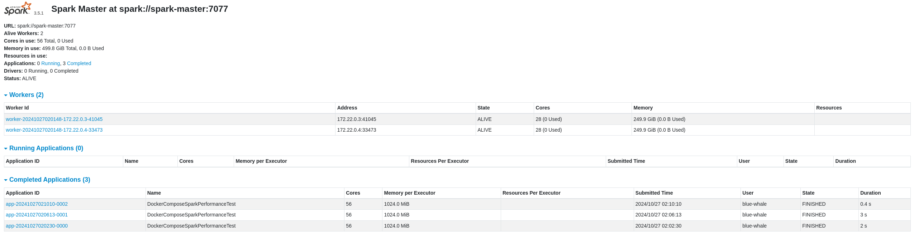

# How To Setup Spark with docker compose

- 현재 쿠버네티스 환경에서 운영하는 것을 가정해서, 별도의 도커 이미지를 직접 빌드하지는 않았고, 

```bash
> sudo docker-compose up -d
```

## Result

- 현재는 로컬이 살짝 빠른 것으로 표현되는데, 개선법을 찾아봐야함.

```
Setting default log level to "WARN".
To adjust logging level use sc.setLogLevel(newLevel). For SparkR, use setLogLevel(newLevel).
24/10/27 11:06:12 WARN NativeCodeLoader: Unable to load native-hadoop library for your platform... using builtin-java classes where applicable
Total sum from 1 to 1000000 using Spark: 500000500000                           
Spark execution time: 2.9670467376708984 seconds
Total sum from 1 to 1000000 using local Python: 500000500000
Local execution time: 0.034537315368652344 seconds
Local Python is faster by 2.93 seconds.
```

