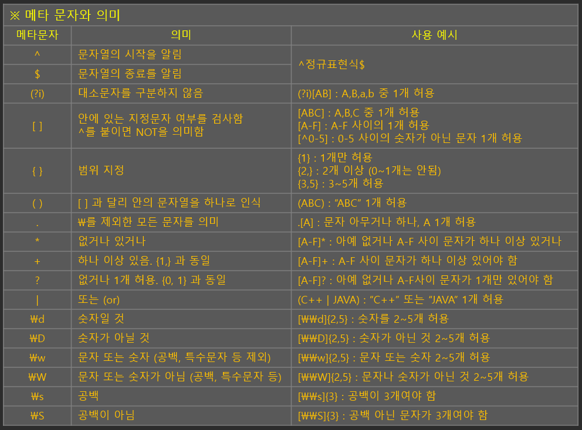

# 어셈블리 언어
- 기계어와 일대일 대응이 되는 컴퓨터 프로그래밍의 저급 언어이다. 
- 전류가 '흐른다'와 '그렇지 않다'로 구성되는 2진수(0과 1)의 기계어는 컴퓨터가 바로 읽을 수 있다는 점만 빼면 장점이 없는 언어이기 때문에 이를 보완하기 위해 나온 언어가 어셈블리어이다.
- 어셈블리 언어를 쓰면 프로그래머가 모든 비트조합을 외우지 않고 이해하기 쉬운 mnemonics 문자, 단어, 패턴 등을 통해 정보를 쉽게 기억할 수 있도록 하는 명령어를 쓸 수 있다. 
- 컴퓨터 구조에 따라 사용하는 기계어가 달라지며, 따라서 기계어에 대응되어 만들어지는 어셈블리어도 각각 다르게 된다. 
- 컴퓨터 CPU마다 지원하는 오퍼레이션의 타입과 개수는 제각각이며, 레지스터의 크기와 개수, 저장된 데이터 형의 표현도 각기 다르다. 모든 범용 컴퓨터는 기본적으로 동일한 기능을 수행하지만, 기능을 어떤 과정을 거쳐 수행할지는 다를 수 있으며, 이런 차이는 어셈블리어에 반영되게 된다.
- 어셈블러 : 어셈블리 언어로 작성된 코드를 읽어서 동등한 기계어 코드를 생성해주는 프로그램


### 부트스트랩(Bootstrap)
- 컴퓨터를 부팅하는 과정은 롬 등에 들어있는 작은 프로그램을 메모리로 읽어오는 것부터 시작한다.(부팅)
- 컴퓨터 전원을 켜면 BIOS(Basic Input/Output System)가 실행된다. BIOS에서 CPU, 메모리 등의 주변 하드웨어를 진단 후에 부팅매체(보통 하드디스크)에 저장된 `부트로더(Bootloader) 혹은 부트스트랩 코드라고 불리는 프로그램을 메모리로 복사한다. 
- 이후 컴퓨터의 제어권은 이 부트로더가 가지게 된다. 부트로더는 디스크에 있는 OS의 코드를 메모리에 올려서 OS를 실행하게 된다. 
- 그 이후로는 컴퓨터의 제어권은 컴퓨터가 종료될 때까지 OS가 가지게 된다. OS는 스스로 실행될 수 없으나 일단 실행돠면 외부 도움 없이 컴퓨터를 완전하게 제어한다.

# 고수준 언어
- 고수준 언어(high-level language) : 인간 친화적인 언어로 문법을 정밀하게 작성하지 않아도 맥락에 따라 많은 부분이 생략 가능하다. 컴퓨터에 가까울수록 저수준 언어, 인간과 가까울수록 고수준 언어라고 한다. 어셈블리 언어보다 더 높은 추상화 단계에서 작동한다. 
- 작성하기가 편하고 유지보수가 쉽다는 장점이 있지만, 컴퓨터가 이해하는 데 시간이 걸리며 고사양 컴퓨터를 요구한다는 단점이 있다. 
- 고수준 언어의 소스 코드는 컴파일러(compiler)라는 프로그램에 의해 실행된다. 
- ex. 포트란


### 컴파일
- 컴파일러를 통해 소스 코드를 기계어로 번역한다. 기계어 코드를 다른 말로 목적 코드(object code)라고도 한다.


# 구조적 프로그래밍
- 구조적 프로그래밍은 스파게티 코드(spaghetti code)를 해결하기 위해 개발되었다. 포트란이나 베이식은 비구조적(unstructured) 언어라고 한다.
- 위에서 아래로 향해 간단한 방법으로 실행되는 절차적 프로그래밍으로 하향식 및 폭포 프로그래밍이라고도 한다. 
- 기존의 GOTO문을 없애거나 최소화하여 한 방향으로 프로그램이 작성되기 때문에 이해하기가 쉽다. 그러나 프로그램을 여러 개로 잘게 나누어 구현하는데, 데이터와 프로그램 실행 절차를 분리하다 보니 데이터 관리가 소홀한 편이다. 또한 프로그램이 길어지면 오히려 너무 복잡해진다는 단점이 있다. 이런 단점을 보완하여 최근에는 객체지향 프로그램이 많이 사용되고 있다.
- ex. C

# 어휘 분석(lexical analysis)
- 코드를 기호로부터 단어와 같은 성격의 토큰으로 변환하는 과정이다.
- 구분된 토큰의 종류와 토큰 값을 구문 분석기에 넘겨준다.

### 상태 전이도
- 레이블을 가진 화살표로 그려긴 방향 그래프
- 각 노드들은 상태를 표현하고 화살표는 어떤 입력문자를 읽으면 어느 상태로 이전해가는지 표시

### 정규식
- 특정한 언어를 표시하는 수학적인 공식
- 패턴 매칭에서 중추적인 역할을 한다.



# 단어에서 문장으로
- 언어를 처리하려면 어휘 분석만으로 충분하지 않고, 여러 단어를 모아서 어떤 문법에 맞는 문장으로 분석해야 한다.


### yacc
- 유닉스 시스템 표준 파서 생성기
- 시프트-리듀스 파서(shift-reduce parser)을 사용하는데, 시프트는 토큰을 스택에 넣고 리듀스는 스택의 맨 위부터 매치된 토큰들을 다른 값으로 대체한다는 뜻이다.

# 누구나 프로그래밍 언어를 만들 수 있는 시대
- 어를 어떻게 구체적으로 응용할지 이해하려면, 도메인 특화 언어(DSL : Domain-Specific Language), pic 나 chem 같이 작은 언어를 살펴보자

### DSL
- 특정한 도메인을 적용하는 데 특화된 컴퓨터 언어이다. 어느 도메인에서나 적용 가능한 범용 언어(General-purpose language)와는 반대되는 개념이다.
- 내부 DSL : 호스트 언어 구문을 이용하여 자체적으로 의존하는 무언가를 만드는 경우에 해당된다. 내부 DSL에서는 API와 DSL의 경계가 모호해 비슷하게 생각하는 경향이 있다.
- 외부 DSL : 호스트 언어와 다른 언어 (XML, Makefile과 같은 고유 형식)에서 생성된 DSL이다. 외부 DSL에서는 DSL과 범용 언어(GPL : General Purpose Language)과의 경계가 모호해지는 경향이 있다.
- ex.
    - Web: HTML
    - Shell: sh, Bash, CSH, and the likes for *nix; MS-DOS, Windows Terminal, PowerShell for Windows
    - Markup languages: XML
    - Modeling: UML
    - Data management: SQL and its variants
    - Business rules: Drools
    - Hardware: Verilog, VHD
    - Build tools: Maven, Gradle
    - Numerical computation and simulation: MATLAB (commercial), GNU Octave, Scilab
    - Various types of parsers and generators: Lex, YACC, GNU Bison, ANTLR

# 파스 트리
- 언어 문법으로부터 만들어진 DAG 데이터 구조다.
- 일반적으로 Compiler 와 Interpreter 모두 파스 트리 를 구성한다.


# 인터프리터
- 소스코드를 한 줄 한 줄 읽어가며 명령을 바로 처리하는 프로그램(언어). 번역과 실행이 동시에 이루어진다. 
- 번역 속도는 빠르지만 실행 속도가 느리다. 
- 인터프리터는 파스트리를 실행하게 한다. 
- node의 코드를 사용해 어떤 일을 할지 결정할 수 있다. 변수와 변수의 값을 심볼 테이블에 저장하는 함수, 변수에 연관된 값을 검색(look up) 하는 함수가 추가로 필요하다. 이런 함수는 보통 해시 테이블을 사용한다.
- 리스트 순회와 계산 코드를 yacc에 넣으면 파스트리를 즉시 실행할 수 있다.
- 프론트엔드는 파스트리를 만든다. 파스 트리는 어떤 중간 언어로 표현된다. 백엔드는 이 언어를 실행할 대상의 환경마다 하나씩 존재한다.


# 컴파일러
- 소스코드를 한꺼번에 다른 목적 코드로 번역한 후, 링킹 작업을 통해 실행 프로그램을 생성해 한 번에 실행하는 프로그램(언어)이다. 
- 컴파일러는 인터프리터와 다르게 백엔드 실행 코드 대신 코드 생성기가 들어간다.


### 코드 생성기 (code generator)
- 특정 대상 기계에 대한 기계어 코드를 만든다. 대상 기계의 어셈블리 언어 코드를 만든 뒤, 어셈블러를 사용해 어셈블리 언어코드를 기계어로 번역한다.
- 코드 생성기는 인터프리터와 같은 파스트리 순회와 계산을 수행한다. 다만 파스트리 계산 시 사각형 부분이 계산을 수행하지 않고, 계산을 수행하는 어셈블리 코드를 만들어내도록 변경되었다.
- 어셈블러를 사용해 기계어로 번역하면 컴퓨터에서 실행할 수 있다. 컴파일된 기계어로 실행하면 코드가 더 작고 효율적이어서 인터프리터로 실행할 때보다 훨씬 더 빠르게 실행된다.


# 최적화
- 대부분의 언어 도구에는 Optimizer라는 추가 단계가 파스 트리와 코드 생성기 사이에 들어간다.
- Optimizer는 파스 트리를 분석하고 이 결과를 활용해 더 효율적인 코드를 생성해내도록 파스 트리를 변환한다.
```c
// 루프 안에 대입문이 있는 코드
for (i = 0; i < 10; i++) {
  x = a + b;
  result[i] = 4 * i + x * x;
}

// 최적화기는 a + b가 루프 불변 요소라는 사실을 알아낸다
// (루프를 반복해도 값이 바뀌지 않는 것)

// 루프 불변 요소를 최적화한 루프 코드
x = a + b;
optimizer_created_temporary_variable = x * x;
for (i = 0; i < 10; i++) {
  result[i] = 4 * i + optimizer_created_temporary_variable;
}

// 비용이 많이 드는 연산을 더 적게 드는 연산으로 대신하는 `강도절감` 방식

// 루프 불변 요소 최적화와 감도 절감을 거친 루프 코드
x = a + b;
optimizer_created_temporary_variable = x * x;
optimizer_created_4_times_i = 0;
for (i = 0; i < 10; i++) {
    result[i] = optimizer_created_4_times_i + optimizer_created_temporary_variable;
    optimizer_created_4_times_i = optimzier_created_4_times_i + 4;
}
```

# 하드웨어를 다룰 때 주의하라
- 하드웨어를 조작하는 코드를 최적화하면 예기치 못한 문제가 발생할 수도 있다.
- 전통적으로는 소프트웨어를 일반적인 파일과 하드웨어에 따라 달라지는 파일로 나누고, 일반적인 파일에 대해서만 최적화를 적용하는 식으로 문제를 해결한다.