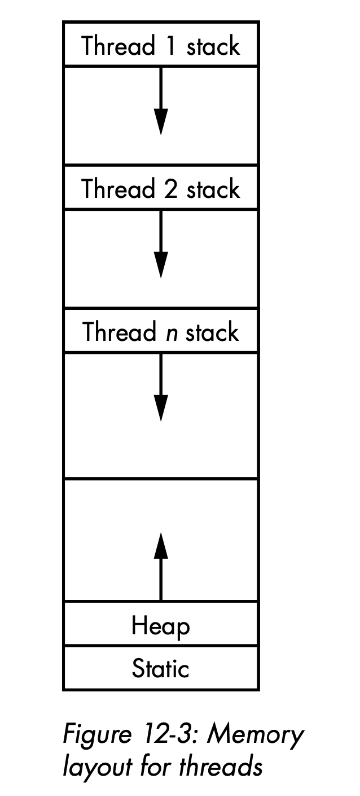
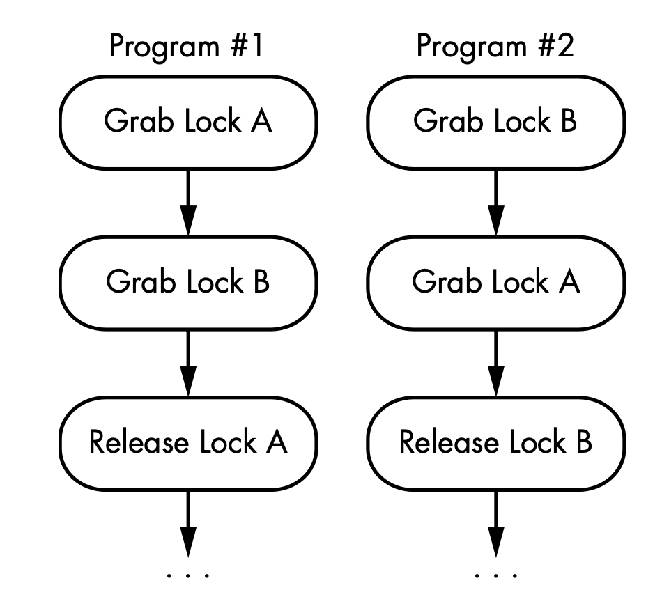
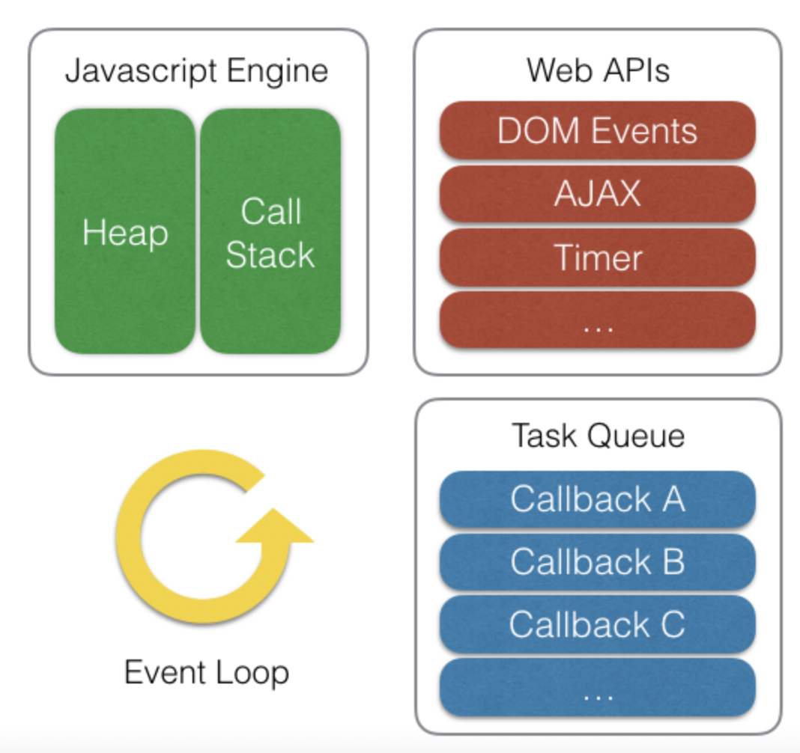

# 경합조건

### 프로그램 program
- `xx데이터를 사용해서 oo작업을 한다`등의 절차를 담은, 실행할 수 있는 파일을 말한다.
- 저장장치(HHD)에 저장될 수 있는 형태로, 이 자체는 "정적"이다.

### 프로세스 process
- OS(운영 체제)의 관점에서 하나의 '작업 단위'이다.
- CPU 스케줄러의 관점에서 task(작업)이라고 부르기도 한다. (ex.멀티 태스크의 어원, 근원)
- 프로그램을 메모리에 올린, "동적"인 상태이다. 프로그램이 실행되면, '프로세스 인스턴스가 생성된다.'고 표현한다.
- `프로세스` = `프로그램` + `PCB`(Process Control Block) : 프로세스가 시작되었다는 것은 프로그램을 메모리에 올리고, CPU를 위한 PCB를 할당했다는 것을 의미한다.

### 스레드 thread
- `프로세스`가 작업의 "전체"라면 `스레드`는 작업을 처리하기 위해서 수행하는 `실행 단위`이다.
- CPU에서 처리하는 실행 하나 하나가 `스레드`인 것이다. CPU는 프로세스로부터 전달받은 스레드를 수행한다. 
- 프로세스는 최소 1개의 스레드를 가지며, 2개 이상의 스레드를 가진 경우 멀티 스레드를 가졌다고 표현한다.


# 공유자원

# 락

### 데드락

- 상호 배제(Mutual Exclusion) : 자원은 한 번에 한 프로세스만이 사용할 수 있어야 한다.
- 점유 대기 (Hold and Wait) : 최소한 하나의 자원을 점유하고 있으면서 다른 프로세스에 할당되어 사용되고 있는 자원을 추가로 점유하기 위해 대기하는 프로세스가 있어야 한다. 즉, 이미 자원을 사용중인데, 다른 프로세스가 사용중인 자원을 사용하기 위해 대기하고 있는 상태의 프로세스가 존재해야 한다.
- 비선점 (No preemption) : 다른 프로세스에 할당된 자원은 사용이 끝날 때까지 강제로 빼앗을 수 없어야 한다.
- 순환 대기 (Circular wait) : 프로세스의 집합에서 P0은 P1이 점유한 자원을 대기하고 P1은 P2가 점유한 자원을 대기하고, P2...Pn-1d은 Pn이 점유한 자원을 대기하며 Pn은 P0이 점유한 자원을 요구해야 한다.고

# 브라우저와 자바스크립트
- 자바스크립트의 큰 특징 중 하나는 단일 스레드 기반의 언어라는 점이다. 
- 자바스크립트는 이벤트 루프(Event Loop) 모델을 사용한다. 그 중 동시성에 대한 처리는 자바스크립트 엔진을 구동하는 환경, 즉 브라우저나 Node.js가 담당한다. 먼저 브라우저 환경을 간단하게 그림으로 표현하면 다음과 같다.


- NodeJS 환경에서도 브라우저의 환경과 비슷한 구조를 볼 수 있다. 잘 알려진 대로 Node.js는 비동기 IO를 지원하기 위해 `libuv 라이브러리`를 사용하며, 이 libuv가 이벤트 루프를 제공한다. 자바스크립트 엔진은 비동기 작업을 위해 Node.js의 API를 호출하며, 이때 넘겨진 콜백은 libuv의 이벤트 루프를 통해 스케줄되고 실행된다.
- **자바스크립트가 단일 스레드 기반의 언어라는 것은 '자바스크립트 엔진이 단일 호출 스택을 사용한다'는 관점이다.**

- 실제 자바스크립트가 구동되는 환경(브라우저, Node.js등)에서는 주로 여러 개의 스레드가 사용되며, 이러한 구동 환경이 단일 호출 스택을 사용하는 자바 스크립트 엔진과 상호 연동하기 위해 사용하는 장치가 바로 '이벤트 루프'인 것이다.

### 단일 호출 스택과 Run-to-Completion
- 자바스크립트 언어의 특징 중 하나는 Run to Completion이다. 하나의 함수가 실행되면 이 함수의 실행이 끝날 때까지는 다른 어떤 작업도 중간에 끼어들지 못한다는 의미이다.
- 자바스크립트 엔진은 하나의 호출 스택을 사용하며, 현재 스택에 쌓여있는 모든 함수들이 실행을 마치고 스택에서 제거되기 전까지는 다른 어떠한 함수도 실행될 수 없다.


# 비동기 함수와 프로미스
### 비동기 방식의 종류
- Callback : 콜백함수는 가장 간단하고 기초적인 비동기 방식이지만, 유지보수가 어렵다
```javascript
  step1(function(value1) {
    step2(function(value2) {
        step3(function(value3) {
            step4(function(value4) {
                step5(function(value5) {
                    step6(function(value6) {
                    // Do something with value6
            })
            })
        })
        })
    })
    })
```
- Promise : 콜백 함수의 error, success의 처리를 보다 간단하게 하기 위한 기능이다. Promise는 `new Promise()`로 생성할 수 있으며, 종료될 때 세 가지 상태를 갖는다.
    - Pending(대기): 이행하거나 거부되지 않은 초기 상태
    - Fulfilled(이행): 완료되어 프로미스가 결과 값을 반환해준 상태
    - Rejected(거부): 실패하거나 오류가 발생한 상태

Promise는 `resolve`, `reject` 2개의 인자를 받으며, 비동기 처리가 성공하면 resolve가 호출되고, 실패하면 reject가 호출된다.

Promise Chaining Promise의 또 다른 특징은 체이닝(chaining)인데, `.then()`을 이용해서 여러개의 Promise를 연결할 수 있다. 이 경우 에러처리는 `catch`를 통해서 할 수 있다.

```javascript
new Promise(function(resolve, reject) {
  setTimeout(function() {
    resolve(0)
  }, 2000)
})
  .then(function(result) {
    console.log(result) // 1. output: 0
    return result + 10
  })
  .then(function(result) {
    console.log(result) // 2. output: 10
    return result + 20
  })
  .then(function(result) {
    console.log(result) // 3. output: 30
  })
  .catch(function(error) {
    console.log(error)
  })
```

```javascript
console.log('hi')

setTimeout(function() {
  console.log('0.1')
}, 100)

Promise.resolve()
  .then(function() {
    console.log('first')
  })
  .then(function() {
    console.log('second')
  })

setTimeout(function() {
  console.log('0')
}, 0)

console.log('end')
```
- hi, end, first, second, 0, 0.1 순으로 출력된다.
- `setTimeout()`과 `Promise`는 모두 비동기 함수이지만, setTimeout은 태스크 큐지만, Promise는 비동기 중에서도 먼저 실행되는 마이크로태스크 큐에 들어있기 때문에 먼저 실행이 된다. 이벤트 루프는 콜 스택이 비면 먼저 마이크로태스크 큐에서 대기하고 있는 함수를 실행 하고, 이후에 태스크 큐에서 대기하고 있는 함수를 가져와 실행한다.

- Async, Await : 비동기 메소드를 동기적인 방식으로 작성할 수 있어 훨씬 간결할 뿐더러, 콜백 지옥을 없앨 수 있게 되었다. 에러 처리는 동기방식처럼 try ~ catch 문으로 작성한다.

```javascript
const asyncFunction = async () => {
  try {
    console.log('first')
    await setTimeout(() => console.log('console!'), 1000)
  } catch (err) {
    console.log(err)
  }
  console.log('end')
}

asyncFunction()
```